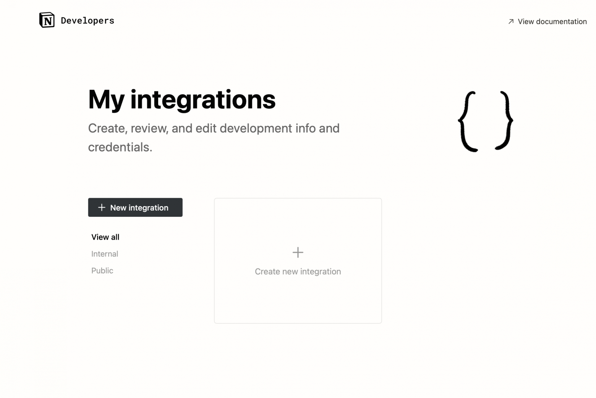
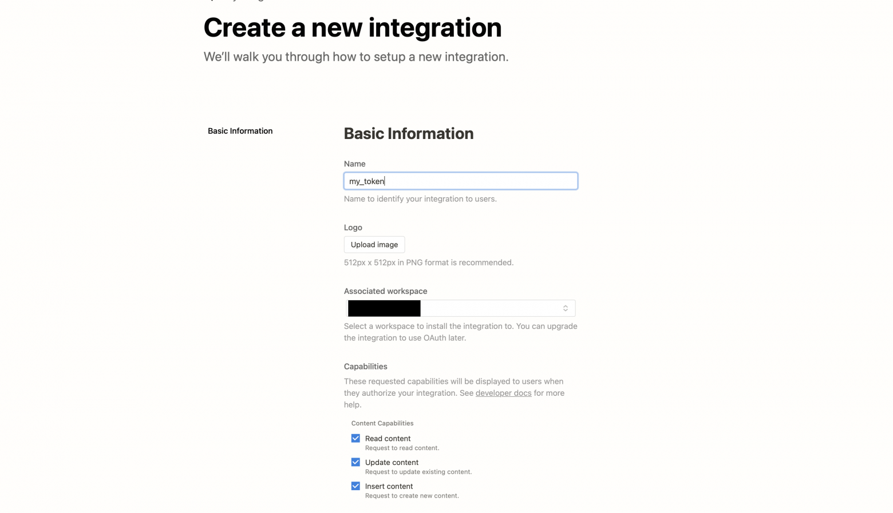
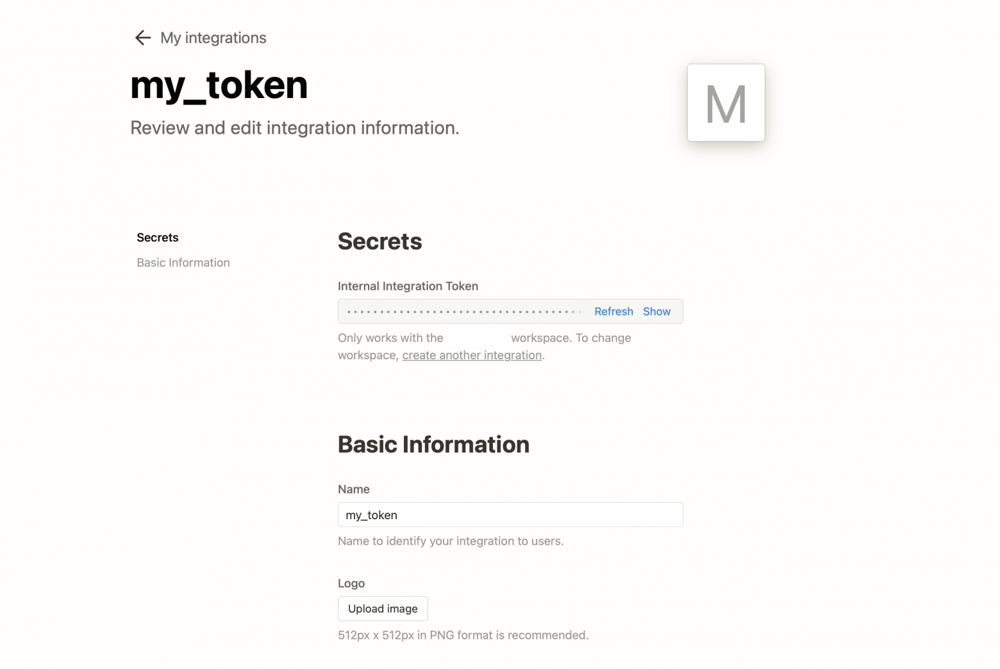
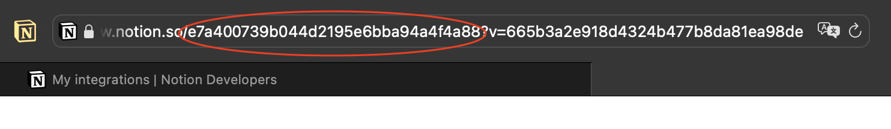
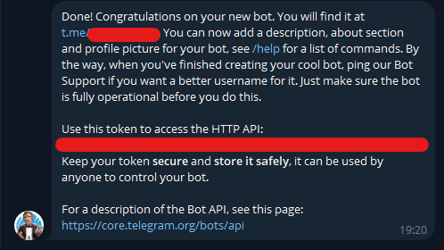
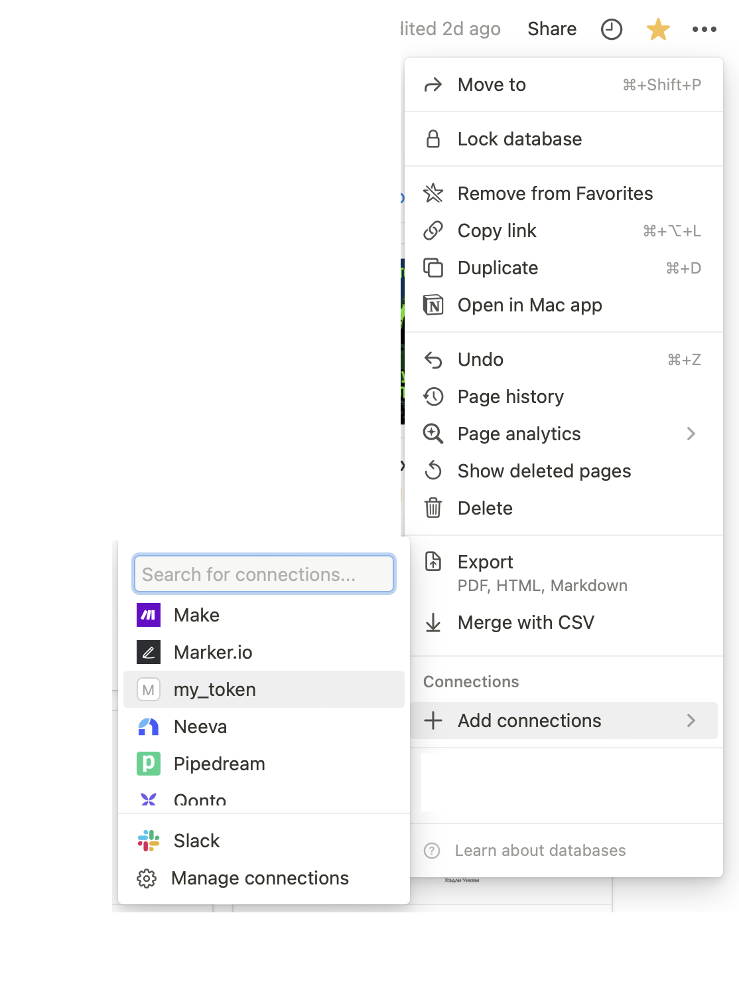

# A simple bot for recording tasks in Notion via a telegram bot. 
## Quick start
### 1. You need to fill out the .env file  
#### NOTION_TOKEN - Follow the link, create a new integration and copy its token

 
#### NOTION_TASK_DB - Go to the database the bot will work with and copy the link, the required ID will be between / and ?v

#### TELEGRAM_BOT_TOKEN - Go to telegram, write to the official bot @BotFather, with the help of which bots are created and moderated. Create a bot and copy its token
 
### 2. Connecting a database in Notion
#### Go to the database page. *IMPORTANT: this must be exactly: Database - full page*
#### In the right corner, click on ... , go to the *Add connections* section, and add your token

### 3. Install all dependencies from requirements.txt and run the bot

